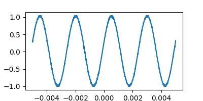

# modian
生成模电实验报告的自动化工具

-----

## 功能
基于python3编写的面向对象的模电实验报告自动化生成工具。该工具可以自动读取双路输入示波器自动保存的波形数据，可以自动检测出峰峰值，频率（可能不准）。自动生成出markdown格式的数据表格。可以应用在模电实验报告实验数据处理方面。

## 使用方法
首先应该有`python3 matplotlib`等常用python工具。程序中涉及到文件路径的部分均采用Linux风格，Windows用户请自行更改或联系作者。

在bash中输入。
```
git clone https://github.com/ybw2016v/modian.git
cd modian
```
将示波器输出的文件复制到modian目录下。
```
python3 mo.py
```

## 输出示例

### 积分电路
|频率|v1|v1波形|v2|v2波形|
|---|----|----|----|----|
|100|2.04||3.36||
|200|2.04||1.74||
|398|2.04||0.94||
|20|2.04||17.40||
|50|2.08||9.20||
|100|2.04||5.44||
|200|2.04||2.64||
|400|2.04||3.36||
